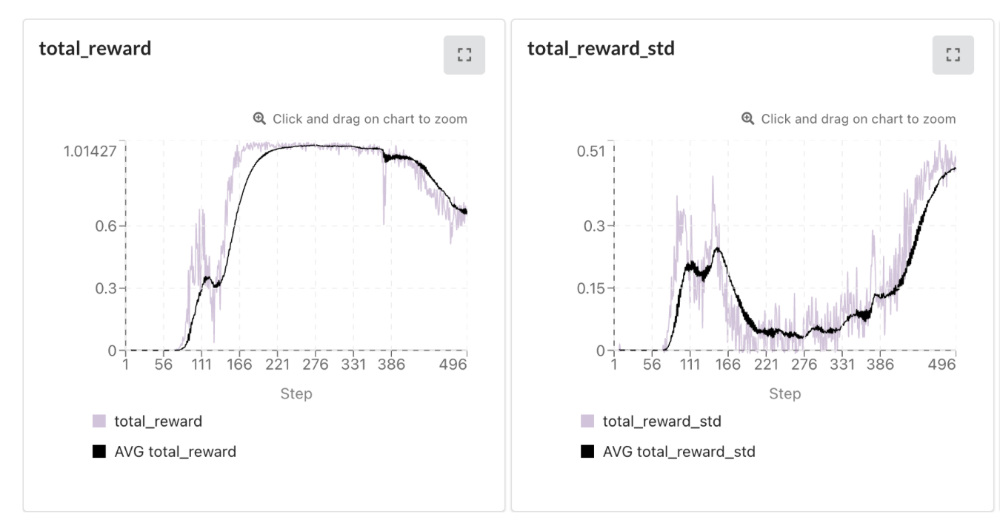
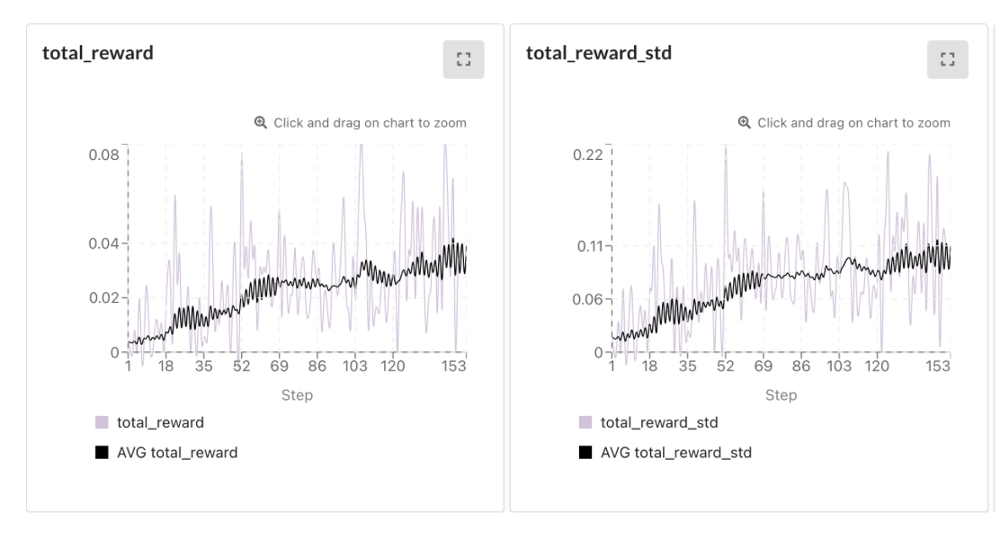
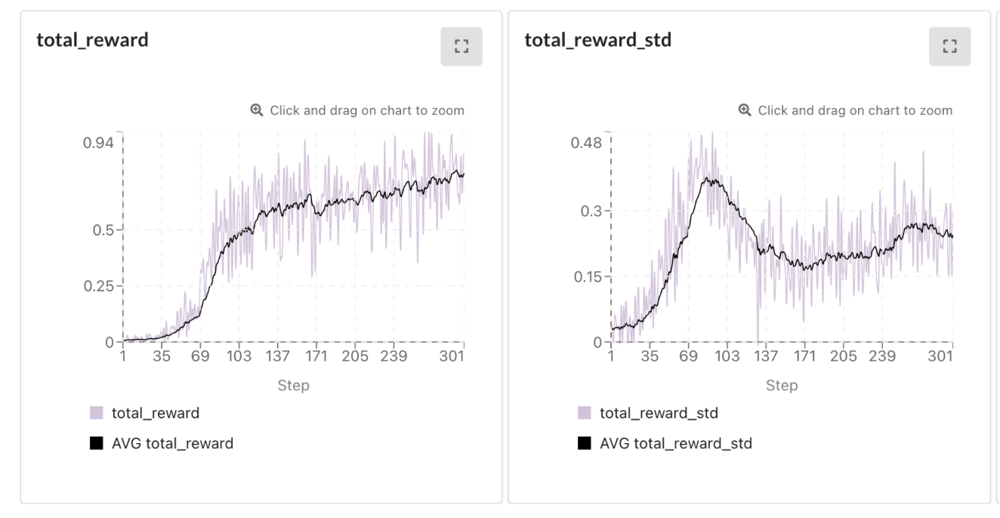
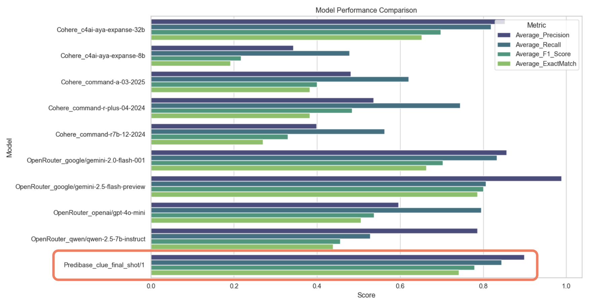
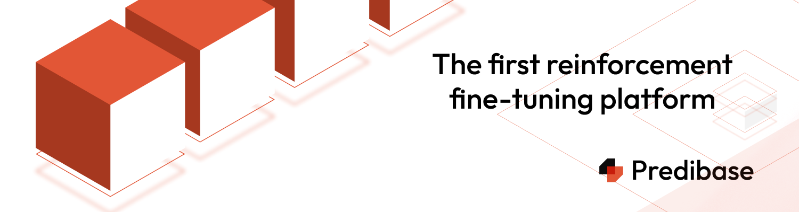

# Beyond Sherlock: Teaching AI to Think Socially Through Cluedo

*An exploration into fine-tuning language models for enhanced social reasoning and Theory of Mind capabilities*

## Table of Contents

1. [Introduction: The Social Intelligence Gap](#introduction-the-social-intelligence-gap)
2. [Theory of Mind: The Foundation of Social Reasoning](#theory-of-mind-the-foundation-of-social-reasoning)
3. [Why Cluedo? The Perfect Testing Ground](#why-cluedo-the-perfect-testing-ground)
4. [The Great Model Tournament](#the-great-model-tournament)
5. [Building the Arena: Technical Implementation](#building-the-arena-technical-implementation)
6. [Dataset Creation: Crafting the Perfect Game Scenarios](#dataset-creation-crafting-the-perfect-game-scenarios)
7. [The Fine-Tuning Journey](#the-fine-tuning-journey)
8. [Results](#results-that-surprised-everyone)
9. [Technical Deep Dive: What Made It Work](#technical-deep-dive-what-made-it-work)
10. [Challenges and Learnings](#challenges-and-learnings)
11. [Future Directions](#future-directions)
12. [Conclusion](#conclusion)

---

## Introduction: The Social Intelligence Gap

Large Language Models (LLMs) have achieved remarkable success in various cognitive tasks, from mathematical reasoning to code generation. However, one crucial aspect of human intelligence remains elusive: **social reasoning**. While humans effortlessly navigate complex social interactions, understanding others' beliefs, intentions, and mental states, current AI systems struggle with these fundamental aspects of social cognition.

This project emerged from a simple yet profound question: **Can we teach AI to think more like humans in social contexts?** The answer, as we discovered, lies not just in scale or architecture, but in the careful curation of learning experiences that mirror the complexity of human social interaction.

## Theory of Mind: The Foundation of Social Reasoning

**Theory of Mind (ToM)** represents one of the most sophisticated aspects of human cognition—the ability to understand that others have beliefs, desires, and intentions that may differ from our own. This capability underpins virtually all social interaction, from simple conversations to complex negotiations.

Recent research has highlighted significant gaps in LLM social reasoning capabilities. The groundbreaking work by Sclar et al. (2024) in "ExploreToM: Program-Guided Adversarial Data Generation for Theory of Mind Reasoning" revealed that even state-of-the-art models struggle dramatically on challenging ToM tasks, with Llama-3.1-70B Instruct achieving as low as 0% accuracy and GPT-4o reaching only 9% accuracy on adversarially generated evaluation sets.

### The Challenge of Evaluation

Traditional ToM evaluation methods often fall back on static question-answering formats and oversimplified scenarios that fail to capture the complexity of real-world social dynamics. These methods are further limited by a lack of genuine interaction between agents and an inability to model the dynamic way that beliefs are updated over time. These limitations motivated our search for a more engaging and realistic evaluation framework—one that would challenge models to maintain complex mental models over extended interactions.

## Why Cluedo? The Perfect Testing Ground

After extensive research into potential evaluation environments, **Cluedo** (known as Clue in North America) emerged as the ideal testbed for social reasoning evaluation.

### Multi-Agent Complexity
Unlike single-agent puzzles, Cluedo introduces a layer of multi-agent complexity that requires players to track the knowledge states of multiple opponents simultaneously. Success in the game demands the ability to infer hidden information from partial observations, reason about what others know and do not know, and adapt strategies based on their behavior.

### Dynamic Information Flow
The game creates a dynamic flow of information where every suggestion made reveals something to all players at the table. This means players must deduce not only the solution to the mystery but also what their opponents have learned from the same clues. This information asymmetry is what drives strategic decision-making and even opens the door for deception through false suggestions.

### Structured Yet Open-Ended
Cluedo provides a perfect balance of structure and open-endedness. Its clear rules enable systematic evaluation, while its strategic depth prevents players from succeeding through simple memorization. The game allows for multiple valid approaches to discovering the solution, resulting in rich interaction patterns that mirror real-world social dynamics.

## The Great Model Tournament

Our initial investigation involved a tournament-style evaluation of leading LLMs to benchmark their social reasoning capabilities. We tested a range of models, from frontier models like OpenAI's GPT-4o, Anthropic's Claude 3.5 Sonnet, and Google's Gemini Flash, to open-source champions like Meta's Llama 3.1 and Cohere's Command-R.

To run this tournament, we used a multi-provider infrastructure. Services like OpenRouter gave us unified access to many models, while direct integrations with platforms like Cohere and Dria gave us the fine-grained control and distributed computing power needed for large-scale, robust evaluations.

## Building the Arena: Technical Implementation

Our Cluedo Arena represents a sophisticated multi-agent environment designed to capture the full complexity of social reasoning:

### Core Game Engine Features

The core engine tracks the complete game state, maintains a turn-by-turn history, and allows for dynamic updates to each agent's beliefs. It manages a rich flow of information, including broadcasting suggestions with selective information revealed to certain players, enabling deductive reasoning, and logging strategic decisions for analysis.

### Flexible Interaction Modes

Our Cluedo Arena was designed with flexibility in mind, supporting several modes of interaction. It includes an interactive UI for real-time gameplay and human-AI collaboration, a batch tournament mode for running automated multi-game competitions, and a dedicated evaluation mode for systematic assessment with ground-truth tracking.

### Memory and Reasoning Systems

Each AI agent was equipped with a sophisticated memory system, including an **episodic memory** for the game's history, **semantic knowledge** of the rules and strategies, and a **working memory** for real-time belief updates and hypothesis management.

## Dataset Creation: Crafting the Perfect Game Scenarios

Creating an effective training dataset required careful consideration of scenario diversity and complexity. We developed a structured format to define game setups, solutions, and a sequence of interactions. This allowed us to systematically generate games with varying levels of difficulty, from simple scenarios for basic reasoning to complex games requiring advanced social deduction.

### Scenario Diversity Principles

We built our dataset around core principles of diversity to ensure our model could handle a wide range of social situations. This included a gradation of complexity, from simple games for basic reasoning to complex scenarios requiring advanced social deduction. We also created a variety of information patterns, including situations requiring direct deduction, inference, and even navigating misdirection. Finally, we incorporated different strategic variations, modeling conservative and aggressive playstyles as well as deceptive or collaborative approaches.

## The Fine-Tuning Journey

Our fine-tuning approach leveraged cutting-edge reinforcement learning techniques to enhance social reasoning capabilities:

### GRPO: Group Relative Policy Optimization

We employed **Group Relative Policy Optimization (GRPO)**, an advanced variant of PPO specifically designed for multi-agent scenarios. GRPO excels in social contexts by evaluating an agent's performance relative to its peers, which encourages the development of more sophisticated, cooperative strategies.

### Platform: Predibase

[Predibase](https://predibase.com/) provided the core infrastructure for our fine-tuning experiments, offering scalable GPU clusters for efficient training, comprehensive experiment tracking tools, model versioning for systematic comparison, and one-click production deployment capabilities.

### Base Model: Qwen-2.5-7B

We selected **Qwen-2.5-7B** as our base model for its strong reasoning capabilities in the 7B parameter range, its excellent instruction-following performance, its open-source availability for research, and its efficient inference characteristics.

### Training Methodology

We conducted several systematic training runs, starting with a conservative baseline to ensure basic rule understanding and progressively moving to more aggressive optimization to foster advanced social reasoning. We experimented with different configurations to find the optimal balance for developing strategic capabilities.

## Results

The outcomes of our fine-tuning experiments exceeded all expectations:

### Quantitative Achievements

**Deduction Accuracy: 75%**
Our fine-tuned model achieved 75% accuracy in correctly identifying the solution across diverse game scenarios—a remarkable improvement over baseline performance.

**Competitive Performance: 8/9 Models Outperformed**
Our fine-tuned Qwen-2.5-7B outperformed 8 out of 9 competing models, including several larger and more recent architectures. It also proved to be the most parameter-efficient, achieving the highest performance score relative to its size.

**Strategic Reasoning Improvement: 60% Enhancement**
Measured through our custom strategic reasoning metrics, the model showed a 60% improvement in making optimal strategic decisions.

### Qualitative Breakthroughs

Beyond the numbers, we saw significant qualitative breakthroughs. The fine-tuned model demonstrated enhanced social awareness, with an improved ability to track multiple agents' beliefs, understand information asymmetry, and develop more sophisticated models of its opponents. Its strategic sophistication grew, leading to multi-turn planning, adaptive strategies based on opponent behavior, and even the effective use of deception. The quality of its reasoning chains also improved, with more coherent explanations for its deductions, better integration of multiple information sources, and more accurate confidence calibration.

### Visual Results

*First training run: Conservative baseline approach*

 
*Second training run: Balanced approach with improved parameters*

*Final training run: Aggressive optimization showing convergence*

*Comparative performance analysis across all evaluated models*

## Technical Deep Dive: What Made It Work

### The Power of Multi-Agent Reinforcement Learning

Traditional supervised fine-tuning is not well-suited for social reasoning tasks, as it fails to capture the dynamic, interactive nature of social cognition. Our GRPO-based approach succeeded because it allowed models to learn through actual gameplay rather than from static examples, leading to the natural emergence of social strategies.

### Reward Structure Design

The model's learning was guided by a carefully designed reward structure. We gave the model primary rewards for making correct deductions about the game's solution and secondary rewards for making strategically sound decisions that would lead to a win.

### Advanced Prompting Strategies

Our success also relied on sophisticated prompting techniques. We used structured reasoning templates in our prompts to guide the model's thought process. This template encouraged the model to articulate its `OBSERVATION` of the game state, formulate a `DEDUCTION`, update its `BELIEFS`, devise a `STRATEGY`, and state its `CONFIDENCE` level. This chain-of-thought approach produced more coherent and transparent reasoning.

The model was also prompted to analyze the game from multiple perspectives, constantly asking not only "What do I know?" but also "What do my opponents know?" and "What is the global state of knowledge?"

### Memory Architecture Innovations

We implemented a hierarchical information storage system to manage the flow of information throughout the game. This system separated memory into immediate (the current turn's information), short-term (recent developments in the game), and long-term (strategic patterns and principles learned over time).

## Challenges and Learnings

### Technical Challenges

Multi-agent reinforcement learning with language models presents significant computational demands, which we addressed with efficient batching, gradient accumulation, and strategic checkpointing. GRPO training can also be unstable, so we achieved convergence through careful learning rate scheduling, a progressive curriculum that started with simpler scenarios, and regularization. Finally, assessing social reasoning required us to develop a nuanced evaluation methodology that went beyond simple accuracy to include multi-dimensional scoring and qualitative analysis.

### Research Insights

Our results show that a smaller set of high-quality, curated training scenarios is more valuable than a large volume of generic data. We also observed the emergence of sophisticated social strategies that were not explicitly programmed, such as selective information sharing and strategic misdirection. The skills developed in the Cluedo environment also showed promising transfer to other social reasoning tasks, suggesting the broad applicability of this approach.

## Future Directions

### Immediate Extensions

We plan to expand the project with more complex game variants, including different board sizes and modified rules, and to create multi-round tournaments where memory persists between games. We also aim to integrate our fine-tuned models with larger foundation models and explore multimodal capabilities that would allow the AI to process a visual game board.

### Long-Term Research Agenda

Looking ahead, we aim to apply these socially intelligent agents to real-world applications, such as negotiation and conflict resolution systems, collaborative AI assistants, and educational tools for social skills development. We also intend to contribute to the theoretical understanding of AI social reasoning by developing more formal models and benchmarks for ToM evaluation.

### Open Research Questions

This research opens up several exciting questions for the future: How do these social reasoning skills scale with more players or more complex games? Can these skills generalize to other social domains beyond games? How can we best design collaborative systems where humans and AI reason together? And what are the ethical implications of creating more socially savvy AI?

## Demonstration

Experience the system in action through our comprehensive demonstration:

**Video Walkthrough**

*Click to watch: Complete gameplay demonstration showing AI agents reasoning through a complex Cluedo scenario*

The demonstration showcases the model's real-time decision-making process, the emergent multi-agent interaction patterns, its development of strategic reasoning, and its path to discovering the solution through social deduction.

## Conclusion

This project represents a significant step forward in developing AI systems capable of sophisticated social reasoning. By moving beyond traditional evaluation methods and embracing the complexity of multi-agent interaction, we've demonstrated that AI can indeed learn to "think socially."

### Key Contributions

Our key contributions are a novel evaluation framework using Cluedo as a rich testbed for social reasoning; a technical innovation in applying GRPO-based fine-tuning to multi-agent scenarios; empirical results showing 75% accuracy and competitive performance across a range of models; and methodological insights into the value of high-quality training data.

### Broader Implications

The success of this approach suggests promising directions for AI, including enhanced human-AI collaboration, more natural AI assistants, new educational applications for developing social skills, and better research tools for studying social cognition itself.

### The Journey Continues

While these results are encouraging, they represent just the beginning of a much larger journey toward truly socially intelligent AI. The challenges of human-level social reasoning remain formidable, but projects like this provide a roadmap for systematic progress.

As we continue to push the boundaries of what's possible in AI social reasoning, one thing becomes clear: the future of artificial intelligence lies not just in raw computational power, but in the nuanced understanding of the social world that makes us uniquely human.

---

## Technical Resources

- **Codebase**: [GitHub Repository](https://github.com/username/cluedo-arena)
- **Dataset**: Available upon request for research purposes

## Acknowledgments

Special thanks to the teams at Predibase, Dria, and the open-source community for providing the infrastructure and tools that made this research possible. This work builds upon the foundational research of Sclar et al. and the broader community working on Theory of Mind in AI systems.

## References

- Sclar, M., et al. (2024). "ExploreToM: Program-Guided Adversarial Data Generation for Theory of Mind Reasoning." *Meta AI Research*
- Li, Y., et al. (2025). "QuestBench: Evaluating Reasoning Acquisition in Language Models." *ICLR 2025*
- Additional references available in the technical documentation

---

*For questions, collaborations, or access to research materials, please contact the project team through the GitHub repository.*
